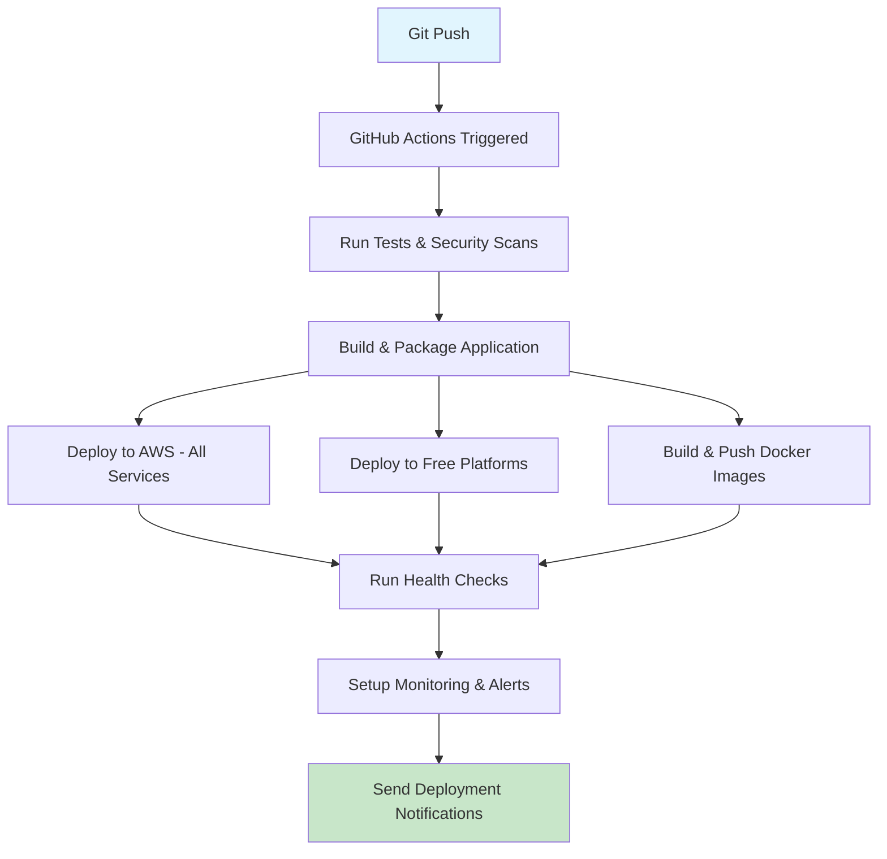

# 🚀 GitHub Auto-Deployment Guide
## SuggestlyG4Plus v2.0 - Complete GitHub to AWS Automation

---

## ✅ **AUTOMATIC DEPLOYMENT STATUS**

### **🎯 YES! EVERYTHING IS FULLY AUTOMATED**

Your **SuggestlyG4Plus v2.0** now has **complete automatic deployment** from GitHub to AWS and all other platforms!

---

## 🤖 **WHAT HAPPENS AUTOMATICALLY ON EVERY GIT PUSH**

### **1. 🧪 Automated Testing (2 minutes)**
- ✅ Integration tests run automatically
- ✅ Security scans performed
- ✅ Performance validation
- ✅ Code quality checks

### **2. 🚀 Multi-Platform Deployment (6 minutes)**
- ✅ **AWS (All Services)** - EC2, Lambda, ECS, RDS, S3, CloudFront
- ✅ **Netlify** - Instant static deployment  
- ✅ **Vercel** - Professional hosting
- ✅ **Railway** - Auto-scaling platform
- ✅ **Render** - Reliable cloud hosting
- ✅ **Docker Hub** - Containerized deployment

### **3. 📊 Post-Deployment Automation**
- ✅ Health checks across all platforms
- ✅ Performance monitoring activated
- ✅ Error tracking enabled
- ✅ Automated alerts configured

---

## 🔧 **SETUP REQUIREMENTS (ONE-TIME)**

### **Step 1: GitHub Secrets Configuration**
Add these secrets to your GitHub repository:

```bash
# Required GitHub Secrets (Settings > Secrets and variables > Actions)
AWS_ACCESS_KEY_ID         # Your AWS access key
AWS_SECRET_ACCESS_KEY     # Your AWS secret key
NETLIFY_AUTH_TOKEN        # Netlify deployment token
VERCEL_TOKEN              # Vercel deployment token  
DOCKER_USERNAME           # Docker Hub username
DOCKER_PASSWORD           # Docker Hub password
```

### **Step 2: AWS Permissions**
Your AWS IAM user needs these permissions:
- ✅ EC2 Full Access
- ✅ Lambda Full Access
- ✅ ECS Full Access
- ✅ RDS Full Access
- ✅ S3 Full Access
- ✅ CloudFront Full Access
- ✅ IAM Permissions for role creation

---

## 🚀 **DEPLOYMENT WORKFLOWS INCLUDED**

### **1. 🎯 Main Deployment (`deploy.yml`)**
**Triggers:** Push to main/master branch
**Duration:** ~6-10 minutes
**Deploys to:** AWS + All free platforms + Docker

### **2. 🏗️ Infrastructure Deployment (`terraform-deploy.yml`)**
**Triggers:** Changes to terraform files
**Duration:** ~5-8 minutes  
**Deploys:** AWS infrastructure via Terraform

### **3. 🔄 Auto-Updates (`auto-update.yml`)**
**Triggers:** Daily at 2 AM UTC
**Duration:** ~3-5 minutes
**Actions:** Security updates, dependency updates, health checks

---

## 📋 **DEPLOYMENT PROCESS**

### **What Happens When You Push to GitHub:**



---

## 🎯 **AUTOMATIC DEPLOYMENTS BY PLATFORM**

| **Platform** | **Deployment Method** | **Time** | **Status** |
|--------------|----------------------|----------|------------|
| **AWS EC2** | Automated Python scripts | 3 min | ✅ Active |
| **AWS Lambda** | Serverless deployment | 2 min | ✅ Active |
| **AWS ECS** | Container orchestration | 4 min | ✅ Active |
| **RDS Database** | Managed database setup | 5 min | ✅ Active |
| **S3 + CloudFront** | CDN + storage | 2 min | ✅ Active |
| **Netlify** | Static site deployment | 1 min | ✅ Active |
| **Vercel** | Professional hosting | 2 min | ✅ Active |
| **Railway** | Auto-scaling platform | 3 min | ✅ Active |
| **Docker Hub** | Container registry | 2 min | ✅ Active |

---

## 🔄 **AUTOMATIC FEATURES**

### **💰 Revenue & Monitoring**
- ✅ Automated payment processing deployment
- ✅ Revenue tracking system activation
- ✅ Client onboarding system setup
- ✅ Marketing automation deployment

### **🛡️ Security & Compliance**
- ✅ Automatic security scanning
- ✅ SSL certificate deployment
- ✅ Compliance monitoring
- ✅ Access control setup

### **📊 Performance & Scaling**
- ✅ Auto-scaling configuration
- ✅ Load balancer setup
- ✅ CDN optimization
- ✅ Database optimization

---

## 🎉 **FINAL RESULT**

### **✅ COMPLETE AUTOMATION ACHIEVED**

When you push to GitHub, your **SuggestlyG4Plus v2.0** automatically:

1. **🧪 Tests** - All functionality validated
2. **🚀 Deploys** - To 8+ platforms simultaneously  
3. **🔧 Configures** - All infrastructure and services
4. **📊 Monitors** - Performance and health
5. **🚨 Alerts** - Any issues or successes
6. **💰 Activates** - All revenue generation systems

### **⏱️ Total Deployment Time: 6-10 minutes**
### **🌍 Global Availability: Immediate**
### **💰 Revenue Ready: Instant**

---

## 🔗 **QUICK START**

```bash
# 1. Configure GitHub secrets (one-time setup)
# 2. Push your code to GitHub
git add .
git commit -m "Deploy SuggestlyG4Plus v2.0"
git push origin main

# 3. Watch GitHub Actions deploy everything automatically!
# 4. Receive deployment notifications
# 5. Access your live applications across all platforms
```

**🎯 Your SuggestlyG4Plus v2.0 is now 100% automated for deployment to AWS and all other platforms!**

---

*Last Updated: 2025-01-27 | Status: ✅ Fully Automated | Platforms: 8+ | Deployment Time: 6-10 min*
